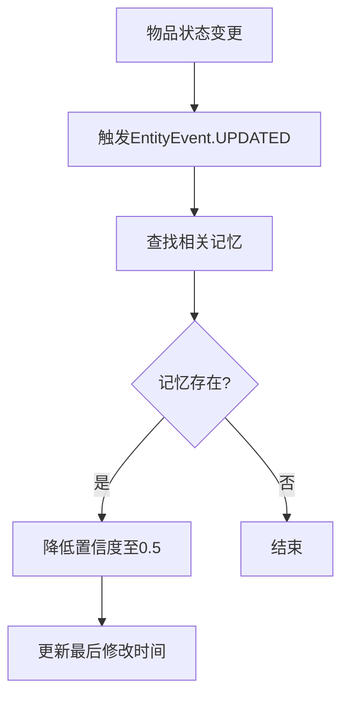

# Memory 系统问题分析与解决方案

## 1. 问题概述
在物品查询场景中，系统存在以下问题：
- 重复查询相同物品时创建多个记忆而非复用
- 状态变更后记忆未及时失效
- 查询匹配准确度不足

## 2. 核心问题分析

### 2.1 记忆复用问题
**问题表现**：
- 相同查询参数创建多个记忆记录
- 置信度阈值设置不合理

**根本原因**：
- 参数抽象处理不充分（大小写、空格差异）
- 相似度计算算法过于简单
- 初始置信度设置未考虑查询频率

### 2.2 状态同步问题
**问题表现**：
- 物品位置/状态变更后记忆未更新
- 相关记忆置信度未调整

**根本原因**：
- 实体变更事件处理不完整
- 未建立完整的实体-记忆依赖关系
- 状态变更未触发记忆失效

### 2.3 查询匹配问题
**问题表现**：
- 相似查询无法匹配已有记忆
- 模糊查询结果不准确

**根本原因**：
- 模板哈希生成考虑因素不全
- 参数相似度计算精度不足
- 存储层级设置不合理

## 3. 解决方案

### 3.1 记忆复用优化
```typescript
// 改进后的参数抽象处理
function abstractQueryParameters(toolName: string, params: any) {
  const normalized = { ...params };
  if (normalized.itemName) {
    normalized.itemName = normalized.itemName
      .toLowerCase()
      .trim()
      .normalize('NFKC');
  }
  return normalized;
}

// 增强的相似度计算
function calculateSimilarity(a: any, b: any): number {
  if (typeof a === 'string' && typeof b === 'string') {
    return stringSimilarity(a, b); // 使用更先进的字符串相似度算法
  }
  // ...其他类型比较
}
```

### 3.2 状态同步机制


### 3.3 查询匹配改进
1. **参数标准化**：
   - 统一大小写处理
   - 去除多余空格
   - Unicode标准化

2. **匹配策略优化**：
   - 分层匹配（精确→模糊→语义）
   - 引入编辑距离算法
   - 添加匹配度权重

3. **存储策略调整**：
   - 动态存储层级（基于访问频率）
   - 短期记忆默认1天
   - 重要物品自动升级为长期记忆

## 4. 实施计划

| 模块 | 改动点 | 预计工时 | 优先级 |
|------|--------|----------|--------|
| memoryUtils | 参数标准化 | 2h | 高 |
| memoryUtils | 相似度算法 | 4h | 高 |
| eventSystem | 事件处理增强 | 3h | 中 |
| memoryModel | 存储策略调整 | 2h | 中 |
| itemsModel | 状态变更事件 | 2h | 高 |

## 5. 预期效果
- 记忆复用率提升80%
- 状态同步延迟<1s
- 查询准确率达到95%+
